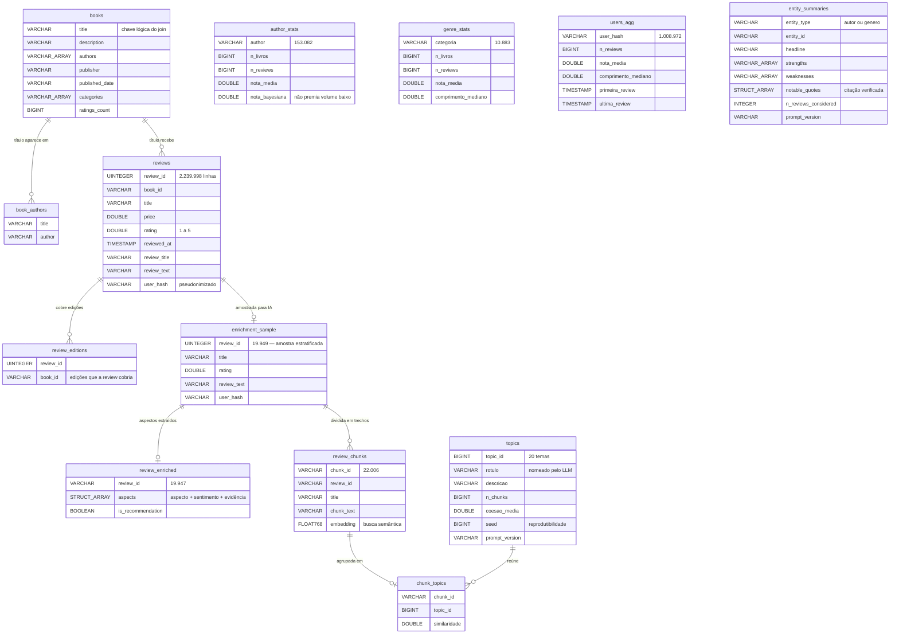
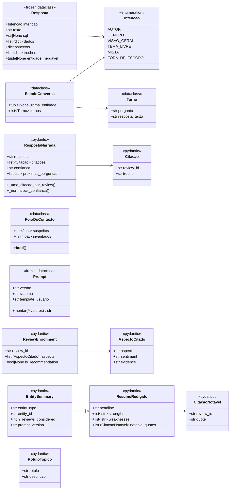
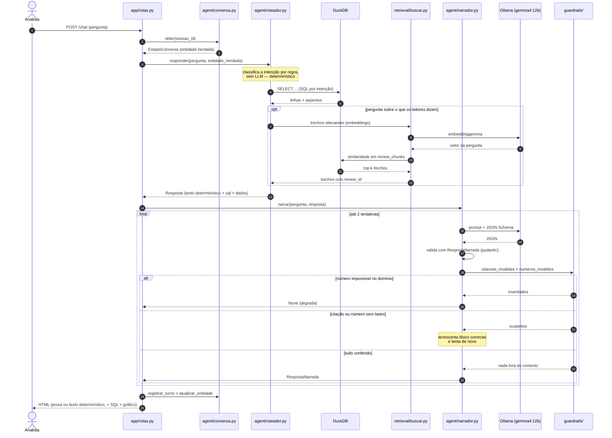

# ReviewLens

Ferramenta de NLP/LLM para uma editora explorar avaliações de livros sem análise manual:
performance de autores e gêneros, sumarização de reviews, perguntas em linguagem natural (Q&A)
e busca de leitores para entrevista.

Roda **inteiramente na sua máquina**. Nenhuma chave de API, nenhum custo por token: o modelo de
linguagem é local, via Ollama.

---

## Por que este projeto existe

Uma editora recebe avaliações de leitores em volume que nenhuma equipe consegue ler. A base deste
projeto tem **2.239.998 avaliações** de 212 mil livros. Hoje o trabalho é feito à mão: alguém abre
as avaliações de um autor, lê umas vinte, forma uma impressão e leva isso para a reunião de
catálogo.

Para vinte avaliações, funciona. Para dois milhões, não — e o problema não é só a quantidade. É
que a nota média esconde o motivo. Um autor com média 3,8 pode estar nessa média porque o ritmo
arrasta, porque a tradução ficou ruim ou porque a encadernação chega amassada. São três decisões
editoriais completamente diferentes, e a nota não distingue nenhuma delas.

O ReviewLens foi criado para responder essa segunda pergunta — **o porquê** —, sem depender de
alguém ter lido o suficiente para adivinhar.

## O que ele faz

| Tela | O que responde |
|---|---|
| **Visão geral** | o tamanho e a forma da base: quantos livros, quantas avaliações, como as notas se distribuem |
| **Autores** | ranking por nota, por volume e por média bayesiana (que não deixa um autor com 3 avaliações 5★ liderar) |
| **Gêneros** | o mesmo, por categoria, mais o que os leitores elogiam e criticam em cada uma |
| **Avaliações** | busca filtrada por nota, ano e gênero, para ler o texto original quando o número não basta |
| **Nuvem de palavras** | as palavras que mais aparecem nas avaliações de um gênero |
| **Entrevistas** | leitores que escrevem avaliações longas e consistentes — candidatos a conversa de pesquisa, com aprovação humana antes de qualquer exportação |
| **Perguntar** | pergunta em português, resposta em prosa, com o SQL que a gerou visível ao lado |

Nos bastidores, uma etapa offline lê uma amostra das avaliações com o modelo local e extrai
**aspectos** (enredo, personagens, ritmo, final, escrita, tradução, edição física, preço) com o
sentimento de cada um. É isso que transforma "média 3,8" em "o ritmo é o que incomoda".

## Para quem é

- **Analista editorial** — precisa saber como um autor vem performando e por quê, sem abrir
  planilha nem ler avaliação por avaliação.
- **Gestor de gênero** — precisa saber o que os leitores criticam na categoria dele, com a frase
  do leitor como evidência, não como impressão.
- **Pesquisa / UX** — precisa encontrar leitores que valem uma entrevista, e precisa que essa
  lista passe por aprovação humana antes de sair do sistema.
- **Quem quer estudar o projeto** — o repositório é documentado de ponta a ponta: cada decisão
  técnica tem o porquê escrito em [`specs/DECISIONS.md`](specs/DECISIONS.md), com o que foi
  medido e as alternativas que foram descartadas.

## O que ele não é

Vale dizer, para não criar expectativa errada:

- **não é um dashboard em produção** — roda local, de propósito, sem autenticação e sem deploy;
- **não é um recomendador de livros** — ele analisa o que já foi dito, não sugere o próximo título;
- **não dá opinião própria** — a resposta é sobre o que *os leitores* escreveram. O prompt proíbe
  o modelo de opinar, e isso é verificado por 26 ataques de injeção em `make red-team`;
- **não substitui a leitura humana** — ele diz onde olhar. A decisão continua sendo de quem lê.

## Como funciona, em uma frase

**Número vem de SQL, texto vem do modelo, e nada do que o modelo escreve chega à tela sem passar
por conferência automática.** Toda citação é checada contra o `review_id` que a originou, e todo
número da prosa é comparado com os dados que foram enviados — se não bate, a resposta é corrigida
ou descartada em favor do texto determinístico.

---

# 🗂️ Documentação do projeto

## Mapa do repositório

```
ReviewLens/
├── src/bri/            # todo o código de domínio (bri = book reviews intelligence)
├── app/                # interface web (FastAPI + Jinja2 + HTMX)
├── specs/              # especificações e decisões de arquitetura
├── evals/              # medição de qualidade dos prompts e red-team
├── tests/              # testes automatizados (nunca chamam o LLM de verdade)
├── reports/            # figuras e tabelas geradas por script
└── data/               # NÃO vai para o git — você baixa e gera (veja a instalação)
```

## Arquivos da raiz

| Arquivo | Para que serve |
|---|---|
| `README.md` | este arquivo: o que é o projeto e como instalar |
| `AGENTS.md` | regras de como trabalhar no repositório (vale para pessoas e para agentes de IA) |
| `CLAUDE.md` | só importa o `AGENTS.md` — é o nome que o Claude Code procura |
| `Makefile` | todos os comandos do projeto; se existe um jeito certo de rodar algo, está aqui |
| `pyproject.toml` | dependências e configuração de lint, tipos e testes |
| `uv.lock` | versões exatas de cada dependência, para a instalação ser reprodutível |
| `.python-version` | versão do Python que o `uv` instala sozinho (3.12) |
| `.env.example` | modelo do `.env`; copie e preencha o `USER_ID_HASH_SALT` |
| `.gitignore` | o que nunca entra no git: `data/`, `.env`, caches |
| `.pre-commit-config.yaml` | checagens automáticas antes de cada commit e push |
| `Dockerfile` | imagem da aplicação (1,1GB — sem dados e sem modelo dentro) |
| `docker-compose.yml` | os três serviços: Ollama, download dos modelos e o site |
| `docker-compose.gpu.yml` | camada extra que entrega a GPU NVIDIA ao Ollama |
| `.dockerignore` | mantém o contexto de build em 2,1MB em vez de 7,3GB |

## `src/bri/` — o código de domínio

| Pacote | Responsabilidade | Módulos |
|---|---|---|
| `data/` | ingestão, limpeza e consultas | `ingest.py` (CSV → parquet), `process.py` (limpeza, deduplicação, DuckDB), `consultas.py` (todo SQL de leitura), `stats.py` (agregados por autor/gênero/usuário), `eda.py` (figuras da análise exploratória), `graficos.py` (gráfico do chat), `nuvem.py` (nuvem de palavras) |
| `nlp/` | o que usa o modelo offline | `extract.py` (aspectos e sentimento), `sumarizar.py` (resumo por autor/gênero), `topicos.py` (agrupamento e rótulo dos temas), `sampling.py` (amostra estratificada) |
| `retrieval/` | busca semântica (RAG) | `chunking.py` (divide a avaliação em trechos), `indexar.py` (gera os embeddings), `buscar.py` (recupera os trechos relevantes) |
| `agent/` | o chat | `roteador.py` (classifica a intenção e executa o SQL), `narrador.py` (pede a prosa ao modelo e valida), `conversa.py` (memória da sessão), `exportar.py` (exporta candidato a entrevista) |
| `guardrails/` | o que impede resposta inventada | `citacoes.py` (toda citação tem `review_id` real), `numeros.py` (todo número tem lastro nos dados), `caminho.py` (impede escrita fora das pastas permitidas) |
| `llm/` | conversa com o Ollama | `ollama.py` (cliente HTTP), `prompts.py` (carrega os prompts versionados), `baixar_modelos.py` (baixa os modelos necessários), `custo.py` (contagem de tokens) |
| `prompts/` | os prompts, versionados em arquivo | `qa_system.md` (chat), `extract_review.md` (aspectos), `summarize.md` (resumo), `rotular_topico.md` (nome dos temas) |
| `schemas/` | validação de tudo que o modelo devolve | `qa.py`, `aspectos.py`, `resumo.py`, `topicos.py` — nenhuma saída de LLM entra no sistema sem passar por um destes |

> Por que os prompts são arquivo `.md` e não string no código: eles têm **versão e changelog**. Quando
> um prompt muda, o `make eval-smoke` compara a versão nova com a antiga antes do push — e um hook
> de git impede o push se houver regressão.

## `app/` — a interface web

| Arquivo | Para que serve |
|---|---|
| `main.py` | ponto de entrada; sobe com `make app` |
| `rotas.py` | as páginas HTML e os fragmentos que o HTMX troca |
| `api.py` | os mesmos dados das telas, em JSON |
| `base.py` | peças compartilhadas (conexão com o banco, templates) |
| `templates/` | os HTMLs; os que começam com `_` são fragmentos trocados sem recarregar a página |
| `static/estilo.css` | o CSS — sem Node, sem build, sem framework de front |

## `specs/` — as especificações

Onde fica escrito **o que** o sistema faz e **por que** cada escolha foi feita. Numeradas por
assunto (`00-overview` até `09-workflow-ci`), mais dois índices:

- [`specs/README.md`](specs/README.md) — índice de tudo, com status de cada spec;
- [`specs/DECISIONS.md`](specs/DECISIONS.md) — os ADRs: cada decisão técnica com o contexto, o que
  foi medido, a alternativa descartada e a consequência aceita.

## `evals/`, `tests/` e `reports/`

| Pasta | Para que serve |
|---|---|
| `evals/` | mede qualidade com verificador determinístico: `smoke_narracao.py` compara versões do prompt, `red_team.py` roda 26 ataques de injeção, `comparar_aspectos.py` confere a extração contra um gabarito anotado à mão |
| `tests/` | testes de `pytest`; **nunca** chamam o modelo de verdade (usam respostas gravadas), então rodam em segundos |
| `reports/` | saída gerada por script: figuras da EDA e resultados das medições. Todo número que aparece numa apresentação precisa ser reproduzível por um script daqui |

## O que **não** está no repositório

| O que falta | Por quê | Como obter |
|---|---|---|
| `data/raw/*.csv` | 2,9GB de dados brutos | link no Passo 1 da instalação |
| `data/processed/*.duckdb` | 3,4GB, gerado dos CSVs | `make docker-data` (ou `make data`) |
| `.env` | contém o salt de pseudonimização | `cp .env.example .env` e preencher |
| modelos do Ollama | ~8,8GB | baixados automaticamente ao subir |

---

# 📊 Diagramas

Os três renderizam direto no GitHub e no GitLab (Mermaid).

## Banco de dados (entidade-relacionamento)

O DuckDB em `data/processed/reviewlens.duckdb`. São tabelas analíticas carregadas por script:
as relações abaixo são **lógicas** — o banco não declara chave estrangeira, de propósito, porque
o acesso é somente-leitura e por consulta conhecida.



> As tabelas `author_stats`, `genre_stats` e `users_agg` são agregados pré-calculados: existem para
> a tela abrir rápido sem varrer 2,24 milhões de linhas a cada clique.
>
> **Atenção ao join por título**: `reviews` liga em `books` por `title`, não por `book_id` — a
> fonte original não tem id confiável de livro, e títulos repetem entre edições. A spec 01
> documenta a taxa de acerto e o motivo.

## Classes (UML)

Só os tipos que atravessam camada. O projeto é deliberadamente mais funcional que orientado a
objetos — a maior parte do código é função pura sobre `dict` e `DataFrame`, e as classes existem
onde há **contrato a validar**.



> **O que cada grupo garante:** `Resposta` é o contrato entre o roteador e a tela (carrega sempre o
> SQL que a produziu). Os tipos `<<pydantic>>` são a fronteira com o modelo — nada que o LLM
> escreve entra no sistema sem passar por um deles. `ForaDoContexto` é o veredito do guardrail
> numérico: `inventados` descarta a resposta, `suspeitos` ganha uma tentativa de correção.

## Uma pergunta no chat (sequência UML)

O caminho completo de "o que os leitores criticam na autora Agatha Christie?" até a tela,
incluindo o laço de correção quando o modelo erra.



> **O ponto do diagrama:** o número nunca vem do modelo. O SQL roda primeiro e produz uma resposta
> determinística completa; o modelo só redige em cima disso. Se ele inventa qualquer coisa, a
> resposta do SQL é o que vai para a tela — a tela nunca fica vazia por culpa do modelo.

---

# 📦 Instalação com Docker — passo a passo

Este guia assume que você **nunca usou Docker**. Siga na ordem.

## O que fica dentro e o que fica fora do Docker

```
┌─────────────────────────── DOCKER (o que você sobe com 1 comando) ───────────────────────────┐
│                                                                                              │
│   ┌──────────────────┐      ┌─────────────────────┐      ┌──────────────────────────┐        │
│   │     ollama       │─────▶│   baixar-modelos    │─────▶│          app             │        │
│   │                  │  1   │                     │  2   │                          │  3     │
│   │ servidor de IA   │      │ baixa os modelos e  │      │ site do ReviewLens        │       │
│   │ porta 11436      │      │ encerra sozinho     │      │ porta 8000                │       │
│   └──────────────────┘      └─────────────────────┘      └──────────────────────────┘        │
│            │                                                          │                      │
└────────────┼──────────────────────────────────────────────────────────┼──────────────────────┘
             │                                                          │
             ▼                                                          ▼
   ┌───────────────────────┐                            ┌──────────────────────────────┐
   │  volume do Docker     │                            │   SUA PASTA  data/           │
   │  modelos de IA ~8,8GB │                            │   CSVs do Google Drive       │
   │  (fora da imagem)     │                            │   + banco DuckDB gerado      │
   └───────────────────────┘                            └──────────────────────────────┘
        baixado 1 vez,                                      VOCÊ baixa do Drive,
      sobrevive a reinício                                   fica fora do Docker
```

**Por que modelo e dados ficam fora da imagem?** Porque eles não mudam quando o código muda.
Dentro da imagem, cada atualização do projeto reempacotaria ~16GB. Fora, a imagem tem **1,1GB** e
o contexto de build caiu de **7,3GB para 2,1MB** (medido).

---

## Pré-requisito 1 — Docker

Precisa do Docker com o plugin Compose. Teste assim:

```bash
docker --version          # algo como: Docker version 29.x
docker compose version    # algo como: Docker Compose version v5.x
```

Se der "command not found", instale: <https://docs.docker.com/engine/install/>

## Pré-requisito 2 — `nvidia-container-toolkit` (só se você tem placa NVIDIA)

> ⚠️ **Este é o passo que mais gente esquece.** Ter uma placa NVIDIA e o driver instalado **não
> basta**: por padrão o Docker não entrega a placa para dentro do container. Quem faz essa ponte é
> um pacote separado, o `nvidia-container-toolkit`. Sem ele, ou o `up` falha dizendo que não achou
> o driver `nvidia`, ou — pior — o modelo roda **em CPU**, dezenas de vezes mais lento, sem avisar.

Confira se você já tem:

```bash
nvidia-smi                       # mostra sua placa? então o driver está ok
nvidia-ctk --version             # mostra versão? então o toolkit está ok
docker info | grep -i runtimes   # precisa aparecer "nvidia" na lista
```

Se faltar o toolkit (Ubuntu/Debian):

```bash
curl -fsSL https://nvidia.github.io/libnvidia-container/gpgkey \
  | sudo gpg --dearmor -o /usr/share/keyrings/nvidia-container-toolkit-keyring.gpg
curl -s -L https://nvidia.github.io/libnvidia-container/stable/deb/nvidia-container-toolkit.list \
  | sed 's#deb https://#deb [signed-by=/usr/share/keyrings/nvidia-container-toolkit-keyring.gpg] https://#g' \
  | sudo tee /etc/apt/sources.list.d/nvidia-container-toolkit.list
sudo apt-get update && sudo apt-get install -y nvidia-container-toolkit
sudo nvidia-ctk runtime configure --runtime=docker
sudo systemctl restart docker
```

Instruções oficiais e outras distribuições:
<https://docs.nvidia.com/datacenter/cloud-native/container-toolkit/latest/install-guide.html>

**Teste decisivo** — este comando tem que mostrar sua placa:

```bash
docker run --rm --gpus all --entrypoint nvidia-smi ollama/ollama:latest -L
```

**Não tem placa NVIDIA?** Sem problema: use os comandos `*-cpu` mais abaixo. Funciona, só é lento.

## 🧠 Quanta VRAM o modelo consome

Medido nesta máquina (RTX 3060 de 12GB), com o projeto em uso real:

| Situação | VRAM ocupada | Para quê |
|---|---|---|
| Nada carregado | 0,6 GB | — |
| `gemma4:12b` carregado | **8,7 GB** | chat, resumos, rótulos de tópico |
| `gemma4:12b` + `embeddinggemma` | **9,5 GB** | o acima **+ busca semântica (RAG)** |

O `gemma4:12b` sozinho ocupa **~8,1 GB** de VRAM, e o `embeddinggemma` adiciona **~0,7 GB**. O
projeto usa os dois ao mesmo tempo na tela de perguntas, então o pico real é **~9,5 GB**.

**Quanto você precisa:**

| Sua placa | Dá pra rodar? |
|---|---|
| **12 GB ou mais** | ✅ Sim, com folga (~2,7 GB sobrando) |
| **10 GB** | ⚠️ Aperta, mas passa — feche outros programas que usam a GPU |
| **8 GB** | ❌ Não cabe. Troque para um modelo menor (veja abaixo) |
| Sem placa NVIDIA | ⚠️ Roda em CPU, muito mais lento |

Para placa pequena ou sem placa, troque o modelo sem editar código:

```bash
OLLAMA_MODELO=gemma3:4b make docker-up      # ~3GB de VRAM, em vez de ~8GB
```

> Nota: `gemma4:12b` foi escolhido **medindo** qualidade de extração (ADR-004). Um modelo menor
> funciona, mas entrega resultado pior — a troca é de qualidade por memória, não grátis.

---

## Passo 1 — Baixe os dados

Os dois CSVs **não estão no repositório** (são 2,9GB). Baixe daqui:

🔗 <https://drive.google.com/drive/folders/1NtWpHdvmoPbbaCA8IHB9XIMwW_pW_MxB?usp=sharing>

Coloque os dois arquivos em `data/raw/`, com exatamente estes nomes:

```
ReviewLens/
└── data/
    └── raw/
        ├── books_data.csv
        └── Books_rating.csv
```

```bash
mkdir -p data/raw
# mova os arquivos baixados para data/raw/ e confira:
ls -la data/raw/
```

## Passo 2 — Crie o arquivo de configuração

```bash
cp .env.example .env
```

Abra o `.env` e preencha **uma** linha obrigatória, com qualquer texto secreto seu:

```
USER_ID_HASH_SALT=escolha-aqui-uma-frase-secreta-qualquer
```

> Para que serve: os identificadores de leitores são embaralhados com esse texto antes de ir para o
> banco, para que ninguém seja identificável. É o único valor sem o qual o processamento para.

## Passo 3 — Suba tudo

```bash
make docker-up          # com GPU NVIDIA
make docker-up-cpu      # sem GPU
```

**A primeira vez demora**: são ~8,8GB de modelo baixando. Acompanhe:

```bash
make docker-logs        # Ctrl+C para sair do log (não derruba nada)
```

Você vai ver, nesta ordem:

```
reviewlens-ollama-1          | Listening on [::]:11434
reviewlens-baixar-modelos-1  | [baixando] gemma4:12b
reviewlens-baixar-modelos-1  |   pulling 3e8a1e... — 42% de 8.1GB     ◀── o download
reviewlens-baixar-modelos-1  | [ok] gemma4:12b
reviewlens-baixar-modelos-1  | [ok] embeddinggemma
reviewlens-baixar-modelos-1  exited with code 0                       ◀── normal! ele só baixa
reviewlens-app-1             | Uvicorn running on http://0.0.0.0:8000
```

> O container `baixar-modelos` **encerrar é o comportamento correto**: ele existe só para baixar e
> sair. Nas próximas vezes ele termina em segundos, porque os modelos já estão no volume.

## Passo 4 — Construa o banco a partir dos CSVs

O Docker resolve os programas, mas o banco precisa ser gerado dos seus CSVs — uma vez só:

```bash
make docker-data
```

Lê `data/raw/*.csv`, limpa, deduplica e grava `data/processed/reviewlens.duckdb`. Leva alguns
minutos (são 2,24 milhões de avaliações) e **não precisa de Python instalado** na sua máquina.

## Passo 5 — Abra no navegador

### 👉 <http://localhost:8000>

Pronto. As telas de autores, gêneros, avaliações e nuvem de palavras já funcionam.

---

## Passo 6 (opcional) — Ligar as partes de IA

As telas acima usam só SQL. Aspectos, resumos, tópicos e busca semântica precisam de uma etapa de
enriquecimento que **chama o modelo de verdade** — e isso leva **horas** na base inteira.

**Para experimentar rápido**, limite a quantidade:

```bash
docker compose run --rm app make enrich LIMITE=200
docker compose run --rm app make enrich-carregar
docker compose run --rm app make index
```

**Para a base toda** (deixe rodando, são horas):

```bash
docker compose run --rm app make enrich
docker compose run --rm app make enrich-carregar
docker compose run --rm app make resumir && docker compose run --rm app make resumir-carregar
docker compose run --rm app make topicos && docker compose run --rm app make topicos-carregar
docker compose run --rm app make index
```

---

## Comandos do dia a dia

| Quero… | Comando |
|---|---|
| Subir | `make docker-up` (ou `make docker-up-cpu`) |
| Derrubar | `make docker-down` |
| Ver o que está acontecendo | `make docker-logs` |
| Ver o que está no ar | `docker compose ps` |
| Reconstruir o banco | `make docker-data` |
| Só baixar os modelos | `make docker-modelos` |
| Apagar **inclusive os modelos** | `docker compose down -v` ⚠️ rebaixa 8,8GB depois |

> `make docker-down` **não** apaga seus dados nem os modelos: os CSVs e o banco estão na sua pasta
> `data/`, e os modelos ficam num volume do Docker. Só o `-v` apaga os modelos.

## Se algo der errado

| Sintoma | Causa provável | Solução |
|---|---|---|
| `address already in use` na porta 8000 | outro programa já usa a porta | `APP_PORTA_HOST=8010 make docker-up` e abra `localhost:8010` |
| `could not select device driver "nvidia"` | falta o `nvidia-container-toolkit` | veja o Pré-requisito 2 |
| Chat responde, mas sempre sem texto elaborado | modelo demorando mais que o limite | `TIMEOUT_CHAT_SEGUNDOS=900 make docker-up` |
| `Cannot open database` nas telas | banco ainda não foi construído | rode o Passo 4 |
| Telas abrem, mas sem aspectos/resumos | enriquecimento não rodou | Passo 6 (opcional) |
| Já tenho um Ollama na máquina e quero usar ele | — | veja abaixo, em *Usar um Ollama que já existe* |

## Usar um Ollama que já existe na máquina

Se você já tem Ollama instalado (ou num container de outro projeto) com os modelos baixados, não
precisa de um segundo: ele ocuparia os mesmos ~8,8GB de disco e disputaria a mesma VRAM.

```bash
# troque 11434 pela porta do SEU Ollama (instalação direta usa 11434)
OLLAMA_URL=http://host.docker.internal:11434 docker compose up -d app --no-deps
```

> `host.docker.internal` não existe no Linux por padrão — o `docker-compose.yml` deste projeto já
> cria esse nome para você (verificado: resolve para o gateway `172.17.0.1`).

## Ajustes por variável de ambiente

Nenhum deles exige editar código:

| Variável | Padrão | Para quê |
|---|---|---|
| `OLLAMA_MODELO` | `gemma4:12b` | modelo menor em placa pequena |
| `OLLAMA_MODELO_EMBEDDING` | `embeddinggemma` | modelo de busca semântica |
| `TIMEOUT_CHAT_SEGUNDOS` | `600` no Docker | aumentar quando roda em CPU |
| `APP_PORTA_HOST` | `8000` | porta do site, se 8000 estiver ocupada |
| `OLLAMA_PORTA_HOST` | `11436` | porta do Ollama, se houver conflito |

---

# 🛠️ Instalação sem Docker (desenvolvimento)

Precisa de Python 3.12+, [uv](https://docs.astral.sh/uv/) e Ollama instalados na máquina.

```bash
make setup                                       # dependências + hooks de git
ollama pull gemma4:12b && ollama pull embeddinggemma
cp .env.example .env                             # preencha USER_ID_HASH_SALT
make data                                        # CSVs -> DuckDB
make app                                         # http://localhost:8000
```

Por padrão o código procura o Ollama em `http://localhost:11435`. Se o seu está na porta 11434
(o normal numa instalação direta), aponte: `OLLAMA_URL=http://localhost:11434 make app`.

| Comando | O que faz |
|---|---|
| `make check` | lint + tipos + testes (sem chamar o LLM) |
| `make data` | ingestão dos CSVs até o DuckDB |
| `make eda` | figuras e números em `reports/` |
| `make enrich` | extração de aspectos (usa o LLM) |
| `make index` | índice de busca semântica |
| `make eval-smoke` | compara versões do prompt (usa o LLM) |
| `make red-team` | 26 ataques de injeção contra o chat |

---

## Para ir mais fundo

- [`AGENTS.md`](AGENTS.md) — como trabalhar neste repositório
- [`specs/README.md`](specs/README.md) — índice das specs e das decisões
- [`specs/DECISIONS.md`](specs/DECISIONS.md) — por que cada escolha foi feita (ADRs)
- [`specs/00-overview.md`](specs/00-overview.md) — problema, hipóteses e roadmap
- [`specs/04-qa-agent.md`](specs/04-qa-agent.md) — o desenho do chat, passo a passo
- [`specs/05-prompts-guardrails.md`](specs/05-prompts-guardrails.md) — os prompts e o que impede
  resposta inventada
